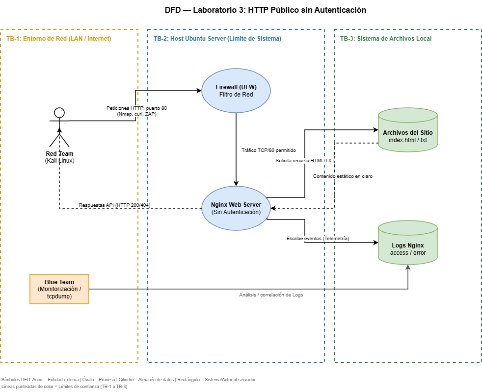

# 🔒 NetOps Secure Execution Portal — Laboratorio 3 FDSI

## Descripción del Proyecto
Prototipo web para la **ejecución controlada de scripts en equipos de red** (firewalls, routers y switches), enmarcado en el *Secure Product Challenge* de Fundamentos de Seguridad de la Información (FDSI). El sistema permite consultar un inventario de dispositivos y simular la ejecución de comandos de solo lectura aprobados por el equipo de ciberseguridad, garantizando la trazabilidad de cada acción.

* **Temática:** Opción 2 — Ejecución controlada de scripts remotos en equipos de red.
* **Línea base deliberada:** Protocolo HTTP en claro y sin autenticación previa (Fase A/B), permitiendo el análisis de riesgos de exposición de metadatos, enumeración y ataques en tránsito antes del endurecimiento (Fase E/F).

---

## 👥 Equipo — Grupo G06
| Rol | Integrante | Responsabilidad |
|-----|-----------|----------------|
| **Product / Builder & Security Lead** | Daniel Julián Peña Bonilla | Despliegue de la solución, configuración de firewall (UFW), control de alcance, ética de IA y gobernanza de riesgos |
| **Blue Team** | Kevin Andrey Ángel Acevedo | Visibilidad de red, captura PCAP, telemetría de logs (Nginx), reglas de detección y aplicación de hardening |
| **Red Team** | Sergio Daniel Buitrago Suancha | Reconocimiento pasivo/activo (Nmap, curl, ZAP), inventario de superficie de ataque y pruebas de penetración autorizadas |

### Reflexiones Individuales (Máx. 250 palabras c/u)

**Daniel Julián Peña Bonilla (Product / Builder & Security Lead):**
> "Durante este laboratorio asumí la responsabilidad de garantizar que el prototipo cumpliera con el principio de mínima exposición en un contexto deliberadamente inseguro (HTTP público). La experiencia demostró cómo omisiones en la fase de construcción —como exponer metadatos de firmware y direccionamiento en archivos públicos o dejar accesible el repositorio `.git`— habilitan vectores inmediatos de reconocimiento pasivo y activo. El ejercicio confirmó que la defensa debe estructurarse en capas: filtrar el tráfico con UFW en el perímetro de red y forzar cabeceras de seguridad junto a directivas de denegación en Nginx. Asimismo, liderar la gobernanza del modelo STRIDE evidenció que la seguridad por oscuridad es ineficaz y que la falta de TLS y autenticación representan una deuda técnica crítica que deberá resolverse en el Laboratorio 4 mediante certificados e identidades federadas." *(142 palabras)*

**Kevin Andrey Ángel Acevedo (Blue Team):**
> "Al asumir el rol defensivo, comprendí la relevancia fundamental de la telemetría y la correlación de eventos temporales. El análisis de tráfico con Wireshark demostró de manera tangible cómo HTTP expone credenciales lógicas, estructuras de datos e inventarios a cualquier observador pasivo en la red (Information Disclosure). La construcción de reglas de detección basadas en respuestas 404 permitió identificar patrones automatizados de fuzzing, aunque evidenció una limitación estructural: sin autenticación, la IP es el único identificador, lo que dificulta atribuir responsabilidades (Repudiation). Implementar `server_tokens off` y cabeceras como `X-Frame-Options` mitiga vectores comunes, pero este laboratorio deja claro que el endurecimiento en HTTP es solo un paliativo frente a la ausencia de confidencialidad e integridad criptográfica." *(126 palabras)*

**Sergio Daniel Buitrago Suancha (Red Team):**
> "La ejecución de pruebas ofensivas autorizadas confirmó la facilidad con la que un atacante puede perfilar un servicio que carece de hardening. Utilizando únicamente Nmap, peticiones curl estructuradas y OWASP ZAP en modo pasivo, fue posible extraer la versión exacta de Nginx (`1.18.0`), inventariar la infraestructura interna de red y acceder directamente a interfaces operativas como `simulate.html` y al archivo sensible `/.git/config`. La ausencia de autenticación validó las hipótesis de Spoofing y Elevación de Privilegios sin requerir exploits complejos. Comprobar que tras la Fase E las mismas peticiones fueron denegadas con códigos 403 y los banners fueron suprimidos demostró el impacto inmediato de los controles defensivos verificables." *(119 palabras)*

---

## 🏗️ Arquitectura y Modelo de Confianza (DFD)

La arquitectura del laboratorio establece tres zonas delimitadas por fronteras de confianza (*Trust Boundaries*):
1. **TB-1 (Límite de Red Externa/LAN):** Separa el origen del tráfico (estación Red Team / Kali) del host objetivo mediante reglas de firewall UFW.
2. **TB-2 (Límite del Host Ubuntu Server):** Separa el filtrado de red del demonio del servidor web Nginx (puerto 80).
3. **TB-3 (Límite del Sistema de Archivos Local):** Aísla los archivos estáticos servidos (`/var/www/netops-portal`) de los registros de telemetría (`/var/log/nginx/`).



---

## ⚙️ Variables de Entorno del Ejercicio
```bash
export TARGET_IP=127.0.0.1
export TARGET_URL=http://$TARGET_IP
export LAB_CIDR=127.0.0.1/32
date -u +%Y-%m-%dT%H:%M:%SZ
```

---

## 🚀 Procedimiento de Reproducción

### 1. Preparación del Host y Firewall (Fase A, Paso 1-5)
```bash
# Actualización e instalación de paquetes
sudo apt update && sudo apt install -y nginx ufw

# Configuración de Firewall perimetral (Paso 5)
sudo ufw default deny incoming
sudo ufw default allow outgoing
sudo ufw allow from "$LAB_CIDR" to any port 80 proto tcp
sudo ufw allow OpenSSH
sudo ufw enable
sudo ufw status numbered
```

### 2. Despliegue de la Aplicación Web
```bash
# Crear directorio web y desplegar archivos
sudo mkdir -p /var/www/netops-portal
sudo cp -r app/* /var/www/netops-portal/

# Configurar VirtualHost inicial (Inseguro - Fase A)
sudo cp nginx/netops-portal.conf /etc/nginx/sites-available/netops-portal
sudo ln -sf /etc/nginx/sites-available/netops-portal /etc/nginx/sites-enabled/
sudo rm -f /etc/nginx/sites-enabled/default
sudo nginx -t && sudo systemctl reload nginx
```

### 3. Aplicación del Hardening Defensivo (Fase E)
```bash
# Reemplazar con la configuración endurecida
sudo cp nginx/netops-portal-hardened.conf /etc/nginx/sites-available/netops-portal
sudo nginx -t && sudo systemctl reload nginx
```

---

## 🎯 Inventario de Superficie de Ataque (Paso 9)

| Elemento | Dato Observado | Riesgo / Pregunta Analítica |
| :--- | :--- | :--- |
| **Host / IP** | `127.0.0.1` | **¿Está limitado al CIDR autorizado?** Sí. Se confirmó que las reglas de UFW descartan cualquier conexión fuera del rango `$LAB_CIDR`. |
| **Puerto** | `80/TCP` (HTTP abierto) | **¿Por qué el tráfico no tiene confidencialidad?** Debido a la ausencia de TLS. Toda la comunicación se transfiere en texto plano, permitiendo sniffing pasivo en el canal. |
| **Servidor** | `nginx/1.18.0 (Ubuntu)` | **¿Se revela versión?** Sí, en la línea base. Permite fingerprinting preciso y búsqueda de CVEs específicos de la distribución. Corregido con `server_tokens off;`. |
| **Ruta /** | `HTTP 200 OK` | **¿Expone información innecesaria?** Enlaza directamente al catálogo de scripts, simulador y registros sin barrera de acceso. |
| **Archivo público** | `/public-inventory.txt` | **¿Qué metadatos entrega?** Inicialmente revelaba versiones de SO de switches/firewalls e IPs internas. Se sanitizó bajo el Paso 16. |

---

## ⏱️ Línea de Tiempo Purple Team (Paso 14)

| Hora UTC | Acción Red Team | Evidencia Blue Team | Conclusión |
| :---: | :--- | :--- | :--- |
| **15:15:05** | `nmap -Pn -sV -p 80 127.0.0.1` | Petición NSE registrada en `access.log` con User-Agent `Mozilla/5.0 (compatible; Nmap Scripting Engine)`. | Diferenciar red vs. aplicación: escaneo SYN no genera log de Nginx; scripts NSE sí generan eventos HTTP. |
| **15:16:00** | `curl -i http://127.0.0.1/` | Registro `GET / HTTP/1.1` código 200 con `curl/7.81.0` en `access.log`. | Correlación exitosa: captura de cabecera `Server: nginx/1.18.0 (Ubuntu)` antes del hardening. |
| **15:16:15** | `curl -I http://127.0.0.1/public-inventory.txt` | Solicitud HEAD 200 OK y tráfico legible registrado en `lab3-http.pcap`. | Exposición de contenido en tránsito sin cifrado. |
| **15:17:10 – 15:17:17** | Fuzzing de rutas (`/admin`, `/api/config`, `/backup.sql`) | 5 códigos 404 consecutivos en 7s en `access.log` y `error.log`. | Alarma activada con éxito por la regla de detección de escaneo (`awk`). |
| **15:18:13** | `curl -i http://127.0.0.1/.git/config` (Pre-hardening) | Registro `GET /.git/config` con código **200 OK** en `access.log`. | Exposición crítica: descarga no autorizada de metadatos de Git. |
| **15:20:00 – 15:20:02** | Exploración pasiva con OWASP ZAP | Peticiones registradas con User-Agent `ZAP/2.13.0`. | Telemetría pasiva correlacionada con reporte de alertas de headers. |
| **15:25:00 – 15:25:05** | Retest (`nmap`, `curl -I`, `curl /.git/config`) | `GET /.git/config` retorna **403 Forbidden** y headers inyectados. | Hardening verificado: mitigación confirmada sin afectar la aplicación. |

---

## 🔄 Comparación Antes / Después de las Correcciones

```
==============================================================================================
CONTROL                     ANTES DEL HARDENING (Fase A)     DESPUÉS DEL HARDENING (Fase E/F)
==============================================================================================
Banner Servidor             Server: nginx/1.18.0 (Ubuntu)    Server: nginx (Versión oculta)
Cabecera X-Frame-Options    Ausente (Vulnerable a clickjack) DENY (always)
Cabecera X-Content-Type     Ausente (Vulnerable a sniffing)  nosniff (always)
Cabecera Referrer-Policy    Ausente                          no-referrer (always)
Listado de Directorios      Habilitable                      autoindex off
Archivos Ocultos (.git)     HTTP 200 OK (Expuesto)           HTTP 403 Forbidden (Bloqueado)
Inventario Público          Exponía IPs de gestión y SOs     Sanitizado (Roles funcionales)
==============================================================================================
```

---

## ❓ 12. Preguntas de Análisis y Conclusiones

### 1. ¿Qué pudo observar el Red Team sin explotar ninguna vulnerabilidad?
Sin enviar payloads ni aprovechar fallos de software, el Red Team obtuvo:
- El software y versión exacta del servidor web (`nginx/1.18.0 Ubuntu`).
- La topología lógica y hostnames de firewalls, routers y switches (`public-inventory.txt`).
- La sintaxis de los comandos de administración aprobados en el catálogo.
- La ausencia de cabeceras de protección defensivas mediante el análisis pasivo de ZAP.
- La totalidad del contenido y estructura HTML inspeccionando los paquetes TCP del puerto 80.

### 2. ¿Qué pruebas de red no aparecieron en access.log y por qué?
El escaneo inicial de puertos con `nmap -Pn -sV -p 80` a nivel de paquetes SYN de capa de transporte no genera registros en `access.log`. Nginx únicamente registra transacciones cuando la conexión TCP completa el handshake de tres vías y el cliente envía una petición HTTP formalmente estructurada (método, URI y versión). Los barridos de puertos solo son visibles en la captura de paquetes (`tcpdump`) o en los registros de filtrado del firewall (`ufw.log`).

### 3. ¿Qué control aplicado reduce exposición, pero no resuelve el riesgo de HTTP?
La directiva `server_tokens off;` y la sanitización del inventario público en el Paso 16 reducen la superficie de información disponible para atacantes oportunistas. No obstante, **no resuelven la vulnerabilidad intrínseca de HTTP**: la falta de cifrado e integridad en tránsito. Cualquier intermediario en la red aún puede capturar el tráfico (sniffing) o alterar las respuestas (tampering/MITM). Este riesgo debe resolverse en el Laboratorio 4 con HTTPS/TLS.

### 4. ¿Qué datos necesitaría Blue Team para distinguir curl legítimo de una actividad sospechosa?
El Blue Team requiere:
- **Identidad autenticada:** Tokens criptográficos o credenciales de operador (JWT, mTLS o API keys).
- **Métricas de frecuencia:** Tasa de peticiones por segundo (detección de patrones automatizados).
- **Dirección IP de origen validada:** Comprobación de pertenencia a segmentos de gestión autorizados.
- **Cabeceras de trazabilidad:** Headers corporativos como `X-Request-ID` o `X-Change-Ticket` asociados a ventanas de mantenimiento aprobadas.

### 5. ¿Qué amenaza STRIDE debe priorizarse en el Laboratorio 4?
Debe priorizarse **Spoofing** (suplantación de identidad), junto con **Information Disclosure**:
En este laboratorio cualquier usuario anónimo puede consultar recursos y simular ejecuciones. En el Laboratorio 4 es imperativo desplegar HTTPS con certificados X.509 para autenticar el servidor y evitar MiTM, complementado con autenticación robusta, manejo seguro de sesiones y control de acceso basado en roles (RBAC).

### 6. ¿Qué conclusión propuesta por la IA no pudo comprobarse directamente?
Durante el análisis asistido por IA, el modelo infirió que *"el acceso a /.git/config probablemente resultó en la fuga de claves privadas SSH y tokens de API de producción"*. Al validar manualmente el archivo del laboratorio, se constató que se trataba de una **alucinación de severidad**: el archivo solo contenía ramas locales ficticias sin secretos ni credenciales reales.

---

## 🤖 Uso Responsable de IA
La IA se utilizó conforme a la Sección 7 como copiloto analítico para estructurar el modelo de amenazas y formular hipótesis defensivas. No se compartieron secretos ni datos reales, y cada inferencia fue contrastada manualmente. El detalle del prompt ejecutado, respuestas y alucinaciones detectadas se encuentra en [`evidence/ia-analysis.md`](evidence/ia-analysis.md).

---

## 📁 Estructura del Repositorio
```
Lab3-FDSI-lab/
├── app/                        # Aplicación web estática del portal
│   ├── audit-log.html          # Registro de auditoría con trazabilidad
│   ├── index.html              # Página principal
│   ├── public-inventory.txt    # Inventario público sanitizado (Paso 16)
│   ├── scripts-catalog.html    # Catálogo de scripts de lectura aprobados
│   ├── simulate.html           # Simulador de ejecución controlada
│   └── style.css               # Estilos visuales del portal
├── nginx/                      # Configuraciones del servidor web
│   ├── netops-portal.conf      # Configuración base (Fase A)
│   └── netops-portal-hardened.conf # Configuración con hardening (Fase E)
├── diagrams/                   # Diagramas de Flujo de Datos
│   └── dfd-lab3.png            # DFD con los 3 límites de confianza (TB-1, TB-2, TB-3)
├── evidence/                   # Evidencias técnicas
│   ├── red/                    # Evidencias ofensivas (Nmap, curl, superficie)
│   ├── blue/                   # Evidencias defensivas (PCAP, Wireshark, logs, reglas)
│   ├── retest/                 # Evidencias post-hardening (Paso 17)
│   └── ia-analysis.md          # Evidencia de uso responsable de IA y alucinaciones
├── reports/zap-passive/        # Reportes de inspección pasiva OWASP ZAP
│   ├── report.html             # Reporte HTML exportado
│   └── report.md               # Resumen ejecutivo de alertas
├── risk-register.md            # Registro formal de riesgos STRIDE
├── stride-analysis.md          # Modelo de amenazas STRIDE detallado
└── README.md                   # Documentación integral del laboratorio
```
