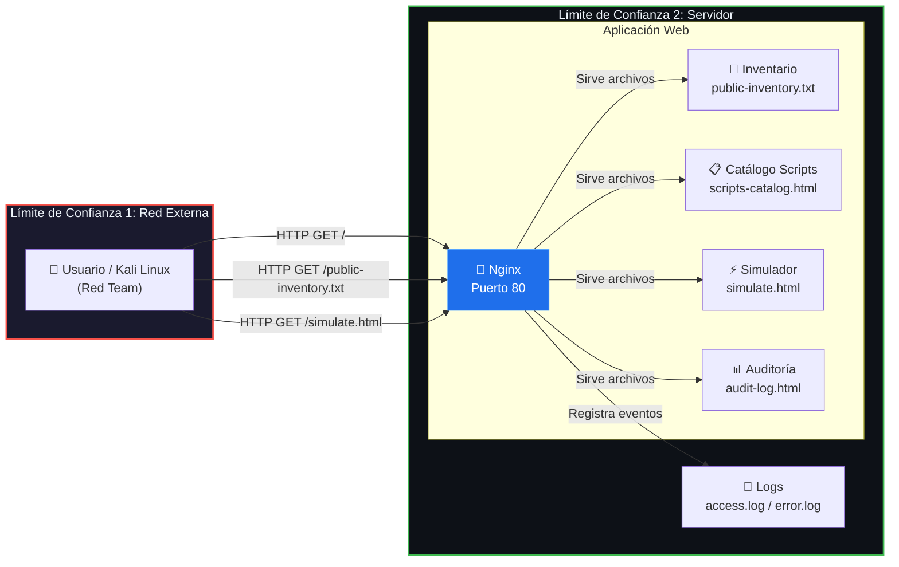

# Diagrama de Flujo de Datos (DFD) — Laboratorio 3

## Grupo G06 | FDSI 2026-2

### DFD Nivel 0 — Portal NetOps

### Descripción de Límites de Confianza

| Límite | Descripción | Riesgo principal |
|--------|------------|------------------|
| **LT1: Red Externa → Servidor** | Tráfico HTTP no cifrado cruza la red. Cualquier nodo intermedio puede observar o alterar el contenido. | Information Disclosure, Tampering |
| **LT2: Nginx → Archivos** | Nginx sirve archivos estáticos sin autenticación. No hay validación de identidad del solicitante. | Spoofing, Elevation of Privilege |

### Flujos de Datos

| # | Origen | Destino | Dato | Protocolo | Protección |
|---|--------|---------|------|-----------|------------|
| F1 | Usuario | Nginx | Solicitud HTTP (GET) | HTTP/1.1 | Ninguna (texto claro) |
| F2 | Nginx | Usuario | Contenido HTML/TXT | HTTP/1.1 | Ninguna (texto claro) |
| F3 | Nginx | Logs | Evento de acceso | Filesystem | Permisos Unix |
| F4 | Usuario | Simulador | Datos del formulario | HTTP/1.1 + JS local | Ninguna |
