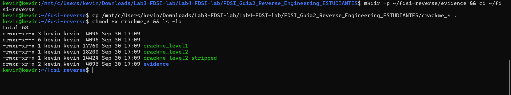
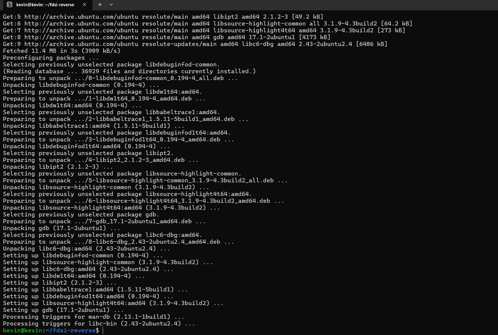
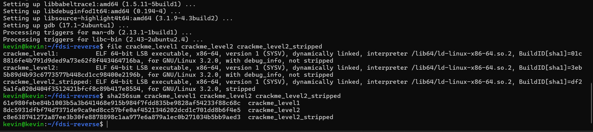
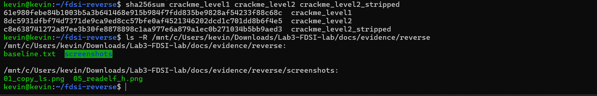
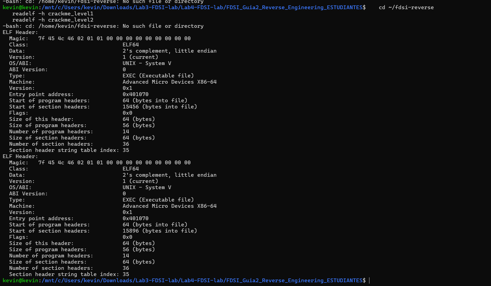

# Punto 0–1 · Preparación y baseline forense

Este paso prepara el entorno de análisis, verifica los tres ejecutables entregados e identifica su formato y arquitectura. El registro completo de comandos, cabeceras y hashes está en [`baseline.txt`](baseline.txt).

## Evidencias visuales

### Copia de los binarios al directorio de trabajo

### Instalación de binutils, GDB y file

### Identificación ELF y hashes SHA-256

### Organización de los documentos de evidencia

### Cabeceras ELF con readelf

## Resultado

Los tres archivos son ejecutables ELF64 para x86-64. `crackme_level1` y `crackme_level2` conservan símbolos de depuración; `crackme_level2_stripped` no los conserva. Los hashes SHA-256 documentados permiten comprobar la integridad de los binarios.
