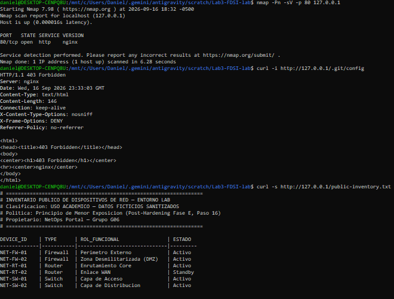

# Evidencias de Retest — Fase F (Purple Team)

## Contexto
Validación técnica reproducible ejecutada tras aplicar el hardening en Nginx (Fase E - Paso 15 y 16), comparando la postura de seguridad antes vs. después.

---

## Captura de Pantalla — Ejecución y Verificación en Vivo

A continuación se presenta la evidencia gráfica en terminal con la ejecución secuencial de los comandos de validación:



### Mapeo de la Evidencia con el Registro de Riesgos (risk-register.md)

| Prueba Ejecutada en la Captura | Hallazgo Visible | Riesgo / Vulnerabilidad Mitigada |
|:---|:---|:---|
| `nmap -Pn -sV -p 80 127.0.0.1` | `80/tcp open http nginx` | **R02 Mitigado:** La versión en texto claro (`1.18.0`) y el sistema operativo (`Ubuntu`) fueron totalmente eliminados del escaneo de servicios, mitigando Banner Grabbing y mapeo de CVEs (CVE-2021-23017, CVE-2021-3618, CVE-2022-41741, CVE-2023-44487). |
| `curl -i http://127.0.0.1/.git/config` | `HTTP/1.1 403 Forbidden` + Cabeceras de seguridad | **R08 Corregido:** Acceso denegado a rutas dotfiles (`.git`). Se evidencian las cabeceras `nosniff`, `DENY` y `no-referrer`. |
| `curl -s http://127.0.0.1/public-inventory.txt` | Catálogo funcional sin direccionamiento | **R09 Corregido (Paso 16):** Supresión de IPs internas `10.0.X.X` y versiones de SO de red en cumplimiento del principio de menor exposición. |

---

## Comandos y Resultados Detallados

### 1. Verificación de Banners y Versión del Servidor (Nmap)
- **Comando:** `nmap -Pn -sV -p 80 127.0.0.1 -oA evidence/retest/nmap_port80`
- **Resultado inicial (Red Team):** `80/tcp open http nginx 1.18.0 (Ubuntu)` (Versión y distribución expuestas).
- **Resultado post-hardening (Retest):** `80/tcp open http nginx`
- **Conclusión y Mitigación de Vulnerabilidades:** 
  - La directiva `server_tokens off;` suprimió exitosamente la versión `1.18.0` y el sistema operativo `(Ubuntu)`.
  - Se mitiga el riesgo de **Banner Grabbing (CWE-200 / Information Disclosure)** y se previene que atacantes mapeen exploits dirigidos a vulnerabilidades conocidas de dicha versión.

### 2. Verificación de Cabeceras de Seguridad HTTP (curl -I)
- **Comando:** `curl -I http://127.0.0.1/`
- **Resultado antes:** Ausencia de headers de protección. Header `Server: nginx/1.18.0 (Ubuntu)`.
- **Resultado después:**
  ```http
  HTTP/1.1 200 OK
  Server: nginx
  X-Content-Type-Options: nosniff
  X-Frame-Options: DENY
  Referrer-Policy: no-referrer
  ```
- **Conclusión:** Cabeceras inyectadas de forma global para mitigar vectores pasivos señalados por OWASP ZAP (Clickjacking y MIME Sniffing). El header `Server` únicamente muestra `nginx`.

### 3. Verificación de Denegación de Archivos Ocultos (curl -i)
- **Comando:** `curl -i http://127.0.0.1/.git/config`
- **Resultado antes:** `HTTP/1.1 200 OK` (exposición del repositorio git y estructura del proyecto).
- **Resultado después:** `HTTP/1.1 403 Forbidden`.
- **Conclusión:** Regla `location ~ /\. { deny all; return 403; }` operando con éxito para bloquear cualquier archivo o directorio que inicie con un punto (`.git`, `.env`, etc.).

### 4. Reducción de Exposición de Inventario (Paso 16)
- **Archivo:** `app/public-inventory.txt`
- **Resultado:** Se retiraron direcciones IP de gestión internas (`10.0.X.X`), ubicaciones físicas y versiones específicas de sistemas operativos de red (`FortiOS 7.4.1`, `pfSense 2.7`, `IOS-XE 17.9`, `NX-OS 10.3`). Solo se publican datos operacionales disociados.
